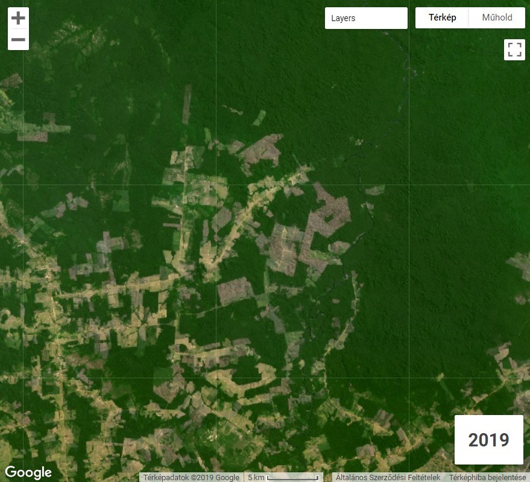
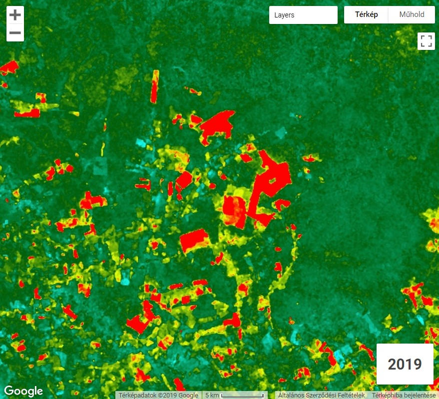

A Szegedi Tudományegyetemen tartott Google Earth Engine kurzusom írott változata. Csatoltam a szükséges kódrészleteket, fájlokat és a prezentációm diáit is. A prezentációban egy kis betekintést nyújtok a Google Earth Engine működésébe, az alábbi pontokra kitérve:

1. Kliens kontra szerver
2. Kommunikáció a szerverrel JSON formátumban
3. Késleltetett végrehajtás
4. A lépték és a vetületek kezelése
5. Adatok importálása és exportálása
6. Earth Engine Apps, az eredmények publikálása
7. Moduláris szerkezet
8. UI komponensek és események


## Záróprojekt: Amazonas NDVI monitoring

Készíteni fogunk egy webalkalmazást, amit publikálni fogunk az Earth Engine Apps segítségével.

Az erdőirtásokat fogjuk nyomon követni az Amazonas-medence déli felén elterülő mintaterületen a Landsat 8 felszíni reflektancia adatok használatával.

A kódokat tartalmazó zip fájlt a mellékletben találod, a cikk alján. Vagy a [Git verziókövető rendszer](https://git-scm.com/) segítségével is letöltheted a parancssorban:

````git
git clone https://earthengine.googlesource.com/users/gulandras90/gee_course_2019
````

### Íme, az eredmény: Erdőirtások Apuí közelében, Brazíliában






## Irodalom

1. Google Earth Engine Team (2015). [Google Earth Engine: A planetary-scale geospatial analysis platform.](https://earthengine.google.com)
2. [Google Earth Engine API kézikönyv.](https://developers.google.com/earth-engine/) 
3. [Google Earth Engine Code Editor.](https://code.earthengine.google.com/)
4. [Google Earth Engine Explorer.](https://explorer.earthengine.google.com)

### Néhány fontos tudnivaló

A GEE nem kereskedelmi célra ingyenesen elérhető, viszont a használata az **Earth Engine Kiértékelők** (Earth Engine Evaluators) számára korlátozott.

* A Google Earth Engine használatához [Google Fiókkal kell rendelkezni](https://accounts.google.com/SignUp?hl=hu).

* Egy űrlapot kell kitölteni [itt](https://signup.earthengine.google.com/). Kb. 1 hét alatt bírálják el, és adnak hozzáférést a platformhoz.

