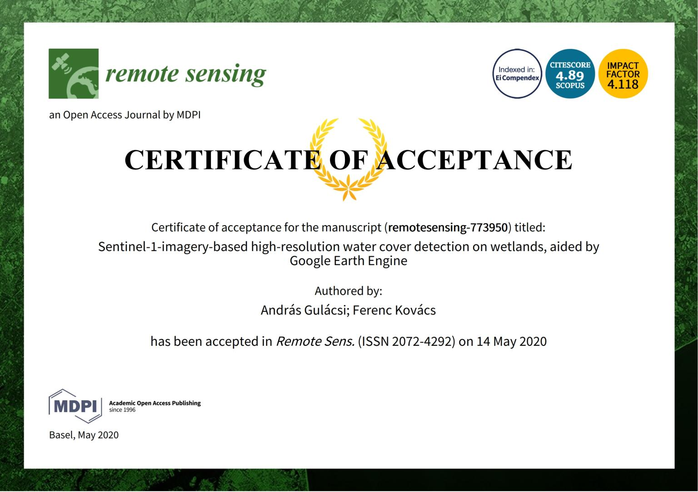

Örömmel jelentem be, hogy május 18-án megjelent az első elsőszerzős tanulmányom a Remote Sensing nemzetközileg elismert folyóiratban. [Link az Open Access cikkhez](https://www.mdpi.com/2072-4292/12/10/1614).

Amennyiben reprodukálni szeretnéd az eredményeimet vagy felhasználni a Sentinel-1 C-SAR adatokat feldolgozó szkriptjeimet (MIT liszensz), tekintsd meg a Github repo-mat: [gee_s1_sar_wetlands](https://github.com/SalsaBoy990/gee_s1_sar_wetlands).

Ha kérdésed van, tedd fel az elérhetőségeimen.

PS. Ha felhasználod a kódomat a tanulmányodhoz, akkor légy szíves tüntesd fel a szkript szerzőjeként a nevemet és hivatkozd meg a tanulmányomat! Köszönöm.

